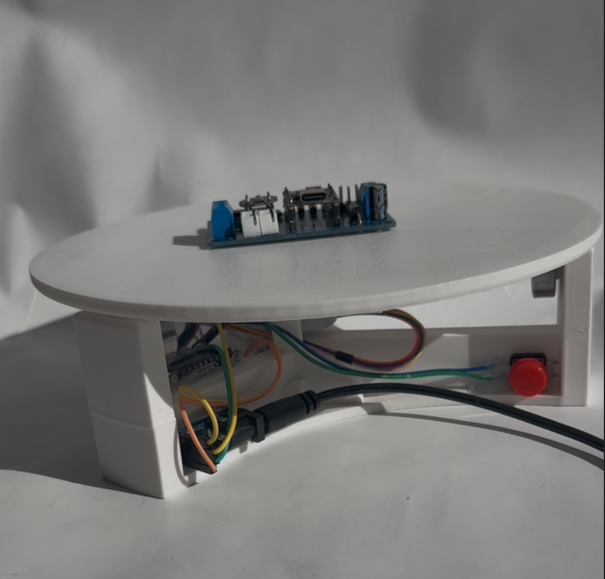

# ESPHome 360° Photo Turntable

A **WiFi-controlled 360° photography turntable** powered by an **ESP32** and **ESPHome**, fully integrated with **Home Assistant**.

📖 **Full build instructions available at:** [Smart 360 Photo Turntable — Full Guide](https://www.espboards.dev/blog/smart-360-photo-turntable-esphome-home-assistant/)

This project upgrades a simple motorized turntable into a smart, automation-friendly tool for product shots, electronics demos, and timelapse photography. It features:

- ✅ **ESP32 + ESPHome control** – no custom firmware coding required  
- ✅ **Home Assistant integration** – start/stop, return to home, and speed control from the dashboard  
- ✅ **Physical push button** – quick manual spins without opening an app  
- ✅ **No soldering build** – DuPont jumpers and hot glue assembly

---

## Features
- **Short press**: start/stop rotation
- **Long press**: return to home position
- **Speed slider** in Home Assistant
- Works with **28BYJ-48 stepper motor** + ULN2003 driver

---

## Hardware
- ESP32 development board
- 28BYJ-48 stepper motor + ULN2003 driver
- Momentary push button
- 5.5×2.1 mm DC barrel jack
- 5V regulated power supply (1A+)
- 3D-printed turntable base & top ([Original model on Printables](https://www.printables.com/model/13776-photo-or-video-turntable-motorized-608-bearing))

---

## ESPHome YAML
Full YAML configuration is included in [`esphome/360-pod.yaml`](esphome/360-pod.yaml).  
Update WiFi credentials, API key, OTA password, and GPIO pins to match your hardware.

---

## Assembly Overview
1. **Print** the turntable parts.
2. **Wire** the ESP32 to ULN2003, button, and power.
3. **Flash** ESPHome configuration to ESP32.
4. **Assemble** electronics into the base.
5. **Test** control via push button and Home Assistant.

---

## Demo
🎥 [YouTube Demo](https://www.youtube.com/shorts/kTo7JYwBktw)

---

## License
MIT License – see [LICENSE](LICENSE) for details.
